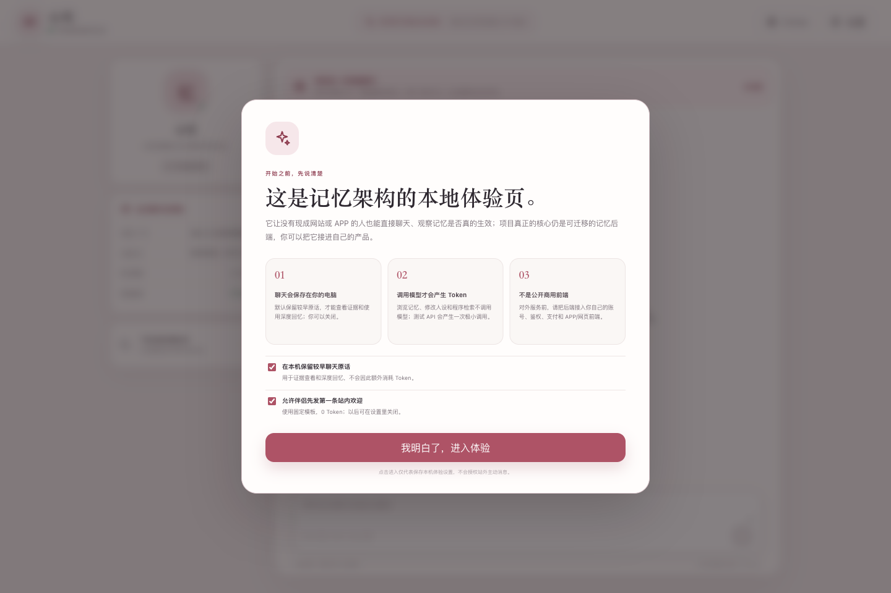
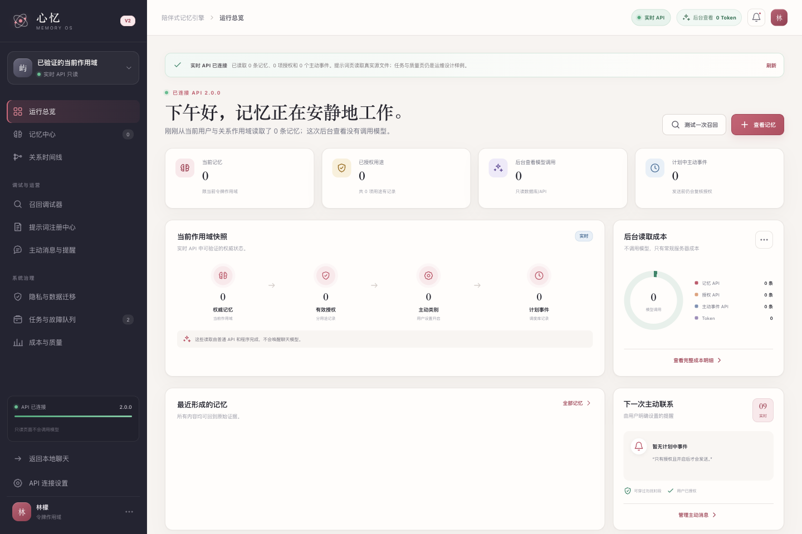
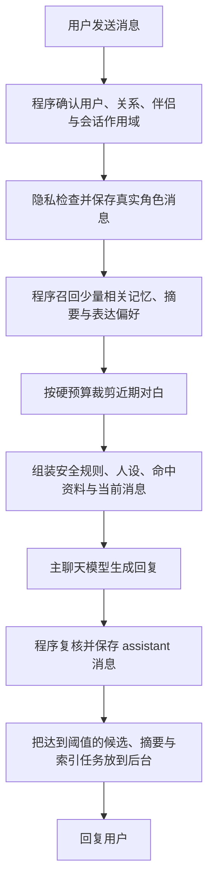
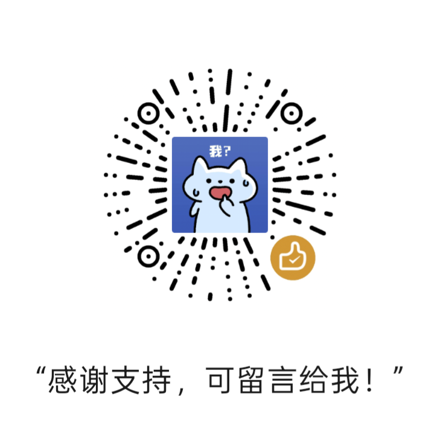

<div align="center">

# 心忆 HeartMemoryOS

### 为长期 AI 陪伴关系设计的可迁移、可解释、低 Token 记忆架构

[](#当前边界)
[](#三分钟开始体验)
[](./LICENSE)
[](#文档入口)

让 AI 不必把全部聊天历史塞进上下文，也能在正确的时候想起正确的事。

</div>

> 当前版本是可运行的 Alpha 参考实现：适合本机体验、个人使用、架构验证和接入开发。公开运营或多用户商用仍需完成身份、数据库、队列、通知、监控与合规适配。

## 它解决什么问题

普通聊天模型并没有真正“永久记住你”。最常见的实现只是不断把旧对话塞回 Prompt：聊天越久，输入越贵；一旦截断，较早内容又会消失。只做一份大摘要也不够——细节会被压扁，错误会被固化，用户很难知道记忆从哪里来，更难纠正或删除。

心忆把工作拆开：

- 大模型负责理解语言和生成回复；
- 程序负责身份、权限、检索、Token 预算、版本、删除、提醒和是否发送；
- 旧内容按用途进入近期对白、长期记忆、分段摘要、表达偏好或原话档案；
- 每次只把当前真正需要的一小包资料交给聊天模型。

这样，聊天历史可以持续增长，而单轮上下文不会跟着无限增长。

## 核心能力

| 能力 | 作用 |
| --- | --- |
| 有证据的长期记忆 | 每条 Claim 都可关联来源、时间、版本和现实/设定/扮演世界，减少“记串了” |
| 有界近期上下文 | 最近对白先按条数取样，再按 Token 硬预算裁剪 |
| 程序化普通召回 | 实体、关键词、SQLite 全文检索和排序不调用生成模型 |
| 可选语义召回 | 用户单独授权后可接 Embedding；失败自动退回本地检索 |
| 滚动分段摘要 | 旧片段达到阈值才总结，同一片段通常只付费一次 |
| 深度回忆兜底 | 普通召回不足时，在获准范围内有界查找较早证据；找不到就诚实说明 |
| 可控的“越聊越懂你” | 表达偏好独立于核心人格，可撤回、可过期，模型不能自行改写安全边界 |
| 用户可管理 | 支持查看、纠正、删除、禁记、授权撤回和防止删除后重新学习 |
| 主动消息状态机 | 提醒由调度器、用户开关和发送前复核驱动，不让模型自己“醒来” |
| 可迁移接口 | Memory API、JavaScript Client、OpenAPI、JSON Schema 与 PostgreSQL 生产参考 |

## 界面预览

本地聊天页首先说明测试边界、Token 费用和用户授权：



记忆后台展示当前真实作用域、记忆、授权、召回、主动事件和后台读取成本：



## 一次回复是怎样产生的



主模型看不到完整聊天仓库，只看到这一轮经过授权、过滤和预算裁剪的 `ContextEnvelope`。后台任务失败也不会阻塞当前回复。

## 哪些操作消耗 Token

| 操作 | 模型 Token |
| --- | --- |
| 打开聊天页、后台、设置或查看提示词 | 0 |
| 保存、查看、纠正、删除记忆 | 0 |
| 关键词、实体与 SQLite 全文召回 | 0 |
| 程序组装和裁剪上下文 | 0 |
| 固定第一条欢迎、固定提醒模板 | 0 |
| 主模型生成正常聊天回复 | 每次聊天的主要费用 |
| 明确说“请记住，具体内容”且程序可安全截取 | 不增加记忆模型调用 |
| 隐含记忆候选整理 | 达到阈值后批量调用后台模型 |
| 较早聊天分段摘要 | 达到阈值后偶尔调用后台模型 |
| 外部 Embedding | 仅在配置、授权并实际索引/查询时产生 |
| API 连通性测试 | 一次很小的真实调用 |

“0 Token”仅表示不调用模型；服务器仍会使用少量 CPU、内存、磁盘和网络。

## 三分钟开始体验

### 1. 准备环境

安装 Node.js 22.13 或更高版本，推荐当前 LTS。默认本地体验不需要 Docker，也不需要单独安装数据库。

### 2. 启动

- macOS：双击根目录的 `启动心忆.command`。
- Windows 10/11：双击根目录的 `启动心忆-Windows.bat`。

第一次运行会创建本机 `.env`、生成随机密钥并安装界面依赖。完成后会自动打开：

> 下载的 ZIP 很小，是因为它不重复打包可自动安装的 `node_modules`。首次启动需要联网下载与当前系统匹配的界面依赖；以本项目当前版本在 Mac 上实测，安装后目录可能增加约 700～800 MB。不同系统和依赖版本会有变化，建议至少预留 1 GB 磁盘空间。这是本机程序依赖，不是聊天数据，也不会产生模型 Token 费用。

- 聊天体验：`http://127.0.0.1:3000`
- 记忆后台：`http://127.0.0.1:3000/console`
- API 健康检查：`http://127.0.0.1:8787/health/ready`

关闭启动终端，会停止由本次启动的本地服务。macOS 已实机验收；Windows 启动逻辑已做兼容与自动化检查，但尚未覆盖每一种 Windows 10 实机环境。

也可以使用命令行：

```bash
npm run setup
npm run doctor
npm test
npm run launch
```

### 3. 配置模型

打开右上角“设置 → 模型 API”，填写 OpenAI-compatible 平台的 Base URL、API Key 和模型名。只填主模型就能聊天；后台整理默认复用主模型，也可以改用更便宜的小模型。Embedding 完全可选，不配置仍可使用本地普通召回。

API Key 只保存在本机服务端的 `data/local-secrets.json`，浏览器接口只返回“已配置/未配置”，不会返回原文。

## 推荐测试方法

```text
先正常聊几句
→ 说“请记住，我的猫叫小白”
→ 换几轮后追问猫叫什么
→ 明确纠正这条信息
→ 到记忆后台删除
→ 再次追问
```

这能同时检查写入、召回、证据、纠正、删除与防复活，而不只是看一张静态后台页面。

## 接入已有 APP、网页或机器人

本地聊天页只是体验外壳，不是强制前端。已有产品通常保留自己的 UI、登录、消息库和管理后台，只把心忆接入后端聊天回合：

```text
产品后端收到消息
→ 调用 /v2/turns:prepare 获取有界上下文
→ 调用自己的主聊天模型
→ 调用 /v2/turns/{turnId}:commit 提交结果
→ Worker 异步处理候选、摘要、索引和提醒
```

接入前请备份原项目、数据库和环境配置。将目标项目与 [`第一次打开后把这个文档发给大模型.MD`](./第一次打开后把这个文档发给大模型.MD) 一起交给能读取、修改并运行代码的编程大模型；文档会先引导个人/商用、单/多用户、单/多伴侣、现有后端、旧数据迁移和部署环境。

## 代码结构

```text
apps/api/               HTTP API、本地伴侣编排与服务端密钥存储
apps/console/           本地聊天页、设置页与记忆控制台
packages/memory-core/   Claim、证据、版本、授权、删除与普通召回
packages/runtime/       回合、后台信号、任务、成本和主动事件
packages/client-js/     可嵌入其他 Node.js 项目的 JavaScript Client
config/                 默认单伴侣“心忆”的可编辑配置
contracts/              OpenAPI、JSON Schema、PostgreSQL 生产参考
prompts/                8 份版本化 Prompt 与注册表
scripts/                设置、诊断、启动、演示、测试和发布工具
deploy/                 可选 Docker 参考；本地双击不会启动 Docker
```

## 文档入口

- [`给用户的一封信.MD`](./给用户的一封信.MD)：小白用户从哪里开始、怎样测试、哪些操作花 Token。
- [`第一次打开后把这个文档发给大模型.MD`](./第一次打开后把这个文档发给大模型.MD)：让编程大模型理解需求、迁移和部署的实施手册。
- [`技术架构与部署说明.md`](./技术架构与部署说明.md)：领域模型、数据流、安全、成本、生产边界和验收细节。
- [`contracts/openapi.yaml`](./contracts/openapi.yaml)：HTTP 机器契约。
- [`CONTRIBUTING.md`](./CONTRIBUTING.md)：参与开发和提交变更。
- [`SECURITY.md`](./SECURITY.md)：私密报告安全问题的方式。

## 当前边界

当前仓库已经实现本机聊天、主模型调用、显式记忆、候选批处理、滚动摘要、普通与可选语义召回、有界深度查找、表达偏好、纠正、删除、第一条欢迎、API 和控制台。

以下是生产适配参考或待目标产品实现，不能把存在 SQL/Docker 文件等同于已经完成公网商用部署：

- 多实例 PostgreSQL Runtime、正式 RBAC 与海量用户容量规划；
- 独立队列与 Worker Pool、真实 APNs/FCM/Web Push/机器人发送通道；
- KMS、对象存储、监控告警、灾备、导入导出执行服务；
- 大规模向量库、批量重建和线上质量评测；
- 目标运营地区的隐私、未成年人、心理安全和数据保留合规。

## 开源状态与许可

本项目采用 [MIT License](./LICENSE)。你可以使用、复制、修改、合并、发布、分发、再许可和销售代码，也可以集成进闭源商业产品；分发代码或其实质部分时，必须保留原版权声明与 MIT 许可文本。

`package.json` 中的 `"private": true` 只用于防止维护者误把内部包发布到 npm，与 GitHub 仓库是否公开、代码是否采用 MIT 无关。

## 自愿支持

如果心忆对你有帮助，欢迎通过下面的赞赏码自愿支持项目继续完善。赞赏完全自愿，不影响项目的免费使用，也不构成购买、付费服务或功能承诺。

<div align="center">
  
</div>

## 研究来源

架构研究参考过 OpenClaw 与 Hermes Agent 的公开记忆设计，但本仓库是独立领域实现，不依赖也不分发它们的源码。版本、哈希与来源说明记录在 [`SOURCE_PROVENANCE.json`](./SOURCE_PROVENANCE.json)。

---

<div align="center">

**不是把你说过的每个字永远塞在模型眼前，而是在正确的时候想起正确的事。**

</div>
